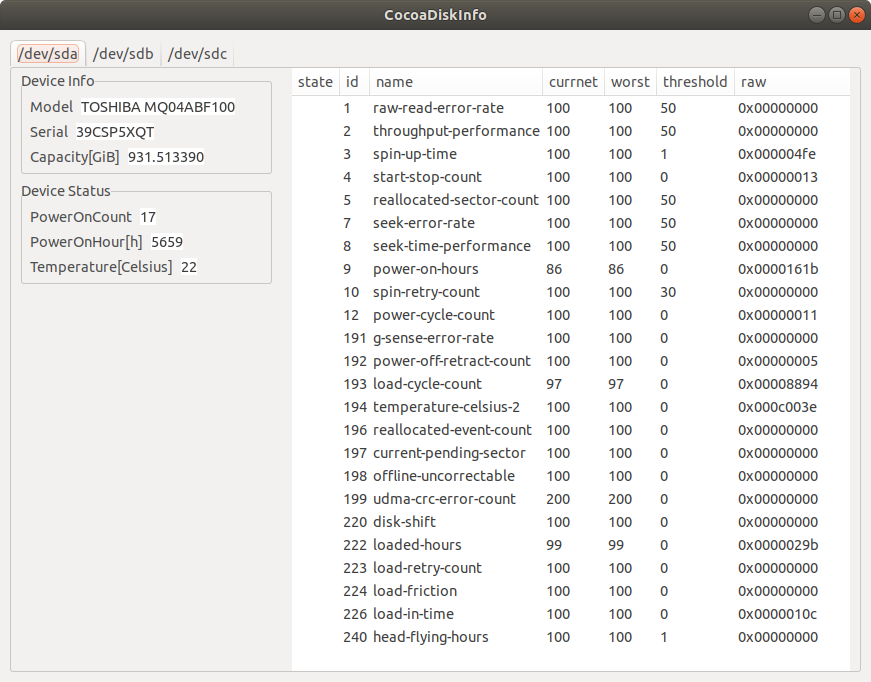

[](https://app.wercker.com/project/byKey/8e5440a7f359d07143937c7573bc0270)

# CocoaDiskInfo
GUI based S.M.A.R.T viewer



# Instration
```
# apt install git cmake clang Ninja libgtkmm-3.0-dev libatasmart-dev libboost1.65-all-dev pkg-config
$ git clone https://github.com/koron0902/CocoaDiskInfo.git
$ cd CocoaDiskInfo
$ mkdir build && cd $_
$ cmake .. -G Ninja
$ ninja
# ./CocoaDiskInfo
```
