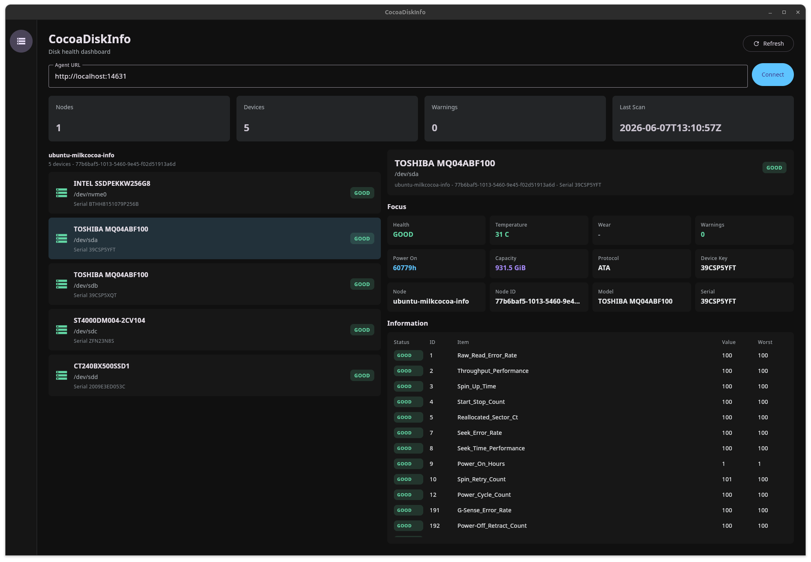

# CocoaDiskInfo

[English](README.en.md)

CocoaDiskInfo は、ストレージの S.M.A.R.T. 情報を「その場で読む」だけでなく、複数マシンの状態を継続的に見えるようにするためのディスクヘルスビューアです。

CrystalDiskInfo のような一覧性と分かりやすさを大切にしつつ、CocoaDiskInfo では agent が各マシンで `smartctl` を実行し、正規化したスナップショットを client から参照する構成を取っています。ローカルPCの確認だけでなく、NAS、ホームサーバー、検証機など、手元に画面がないマシンの状態も同じUIで扱うことを目指しています。



## コンセプト

ストレージの劣化は、発見が遅れるほど判断が難しくなります。CocoaDiskInfo は、温度、通電時間、書き込み量、代替セクタ、NVMe media error などの低レベルな値を、ただ並べるだけでなく、デバイス単位の「いま見るべき状態」として扱います。

重視していることは次の3つです。

- **見える場所を増やす**: agent を対象マシンで動かし、client はHTTP API越しに状態を読む。
- **プロトコル差を吸収する**: ATA/SATA と NVMe の値を、共通の `DiskSnapshot` と health に正規化する。
- **履歴を残せる形にする**: agent 側でSQLiteに保存し、直近値だけでなく将来的な推移確認につなげる。

## 現在できること

- `smartctl --json` を使ったデバイス検出とS.M.A.R.T.取得
- ATA/SATA と NVMe のスナップショット変換
- `GOOD` / `CAUTION` / `BAD` / `UNKNOWN` のヘルス判定
- oneshot 実行による構造化出力またはテキスト形式の出力
- agent 実行による定期収集、SQLite保存、HTTP API配信
- Compose Desktop client によるノード/デバイス一覧、警告数、最終スキャン時刻、詳細値の表示

このリポジトリは開発中です。特にDBマイグレーションやUIの細部はまだ変わる可能性があります。

## 構成

```text
CocoaDiskInfo
├── diskinfo-core    # データモデル、ヘルス判定、共通APIレスポンス
├── diskinfo-agent   # smartctl実行、SQLite保存、HTTP API
├── diskinfo-client  # Compose Desktop UI
├── sample           # smartctl JSONサンプル
└── docs/image       # READMEなどで使う画像
```

### diskinfo-core

`DiskSnapshot`、`MetricsSnapshot`、`UniversalMetrics` など、agent と client が共有するディスク状態の表現を定義します。ATA/NVMeそれぞれの生データを、UIやAPIで扱いやすい共通モデルへ寄せる役割を持ちます。

### diskinfo-agent

対象マシン上で `smartctl` を実行し、検出したディスクのS.M.A.R.T.情報を `diskinfo-core` のモデルへ変換します。agent mode では60秒ごとに収集し、SQLiteへ保存しながら `http://localhost:14631` でAPIを提供します。

### diskinfo-client

Compose Desktop 製のビューアです。Agent URLを指定して接続し、ノード、デバイス、警告数、最終スキャン時刻、デバイス別の詳細情報を表示します。

## 必要なもの

- JDK 21
- `smartmontools`
- `smartctl` を実行できる権限

LinuxやmacOSでは、環境によって `smartctl` の実行に管理者権限が必要です。

## 使い方

### 1. Agentのスキーマを準備する

```bash
./gradlew :diskinfo-agent:run --args='--migration'
```

現在の migration は開発中のスキーマ初期化用途です。既存の `sapphire.db` を保持したい場合は、実行前に退避してください。

### 2. Agentを起動する

```bash
./gradlew :diskinfo-agent:run --args='--agent --scan'
```

特定デバイスだけを見る場合:

```bash
./gradlew :diskinfo-agent:run --args='--agent --device /dev/sda'
```

agent は `http://localhost:14631` でAPIを公開します。

### systemd で agent を常駐させる

Linux では [deploy/systemd/cocoadiskinfo-agent.service](deploy/systemd/cocoadiskinfo-agent.service) をテンプレートとして利用できます。

```bash
./gradlew :diskinfo-agent:shadowJar
sudo install -d /opt/cocoadiskinfo /var/lib/cocoadiskinfo
sudo install -m 0644 diskinfo-agent/build/libs/diskinfo-agent-1.0-SNAPSHOT-all.jar /opt/cocoadiskinfo/
(cd /var/lib/cocoadiskinfo && sudo /usr/bin/java -jar /opt/cocoadiskinfo/diskinfo-agent-1.0-SNAPSHOT-all.jar --migration)
sudo install -m 0644 deploy/systemd/cocoadiskinfo-agent.service /etc/systemd/system/
sudo systemctl daemon-reload
sudo systemctl enable --now cocoadiskinfo-agent
```

特定デバイスだけ監視する場合は、service ファイル内の `ExecStart` を `--agent --device /dev/sda` のように変更します。

### 3. Clientを起動する

```bash
./gradlew :diskinfo-client:run
```

画面上部の Agent URL に `http://localhost:14631` を指定し、`Connect` または `Refresh` で最新状態を取得します。

## Oneshot実行

DBやHTTP APIを使わず、1回だけ取得して出力できます。

```bash
./gradlew :diskinfo-agent:run --args='--oneshot --scan'
./gradlew :diskinfo-agent:run --args='--oneshot --device /dev/sda --output text'
./gradlew :diskinfo-agent:run --args='--oneshot --scan --output json'
```

oneshot でSQLiteにも保存したい場合は `--persist` を付けます。

```bash
./gradlew :diskinfo-agent:run --args='--oneshot --scan --persist'
```

## API

agent mode では次のAPIを提供します。

```text
GET /api/v1/snapshots/latest
GET /api/v1/devices/{deviceKey}/snapshots/latest
```

OpenAPI定義は [diskinfo-agent/src/main/resources/openapi/documentation.yaml](diskinfo-agent/src/main/resources/openapi/documentation.yaml) にあります。

## 開発

よく使う確認コマンド:

```bash
./gradlew :diskinfo-core:compileKotlin
./gradlew :diskinfo-agent:compileKotlin
./gradlew :diskinfo-client:compileKotlinDesktop
```

sample ディレクトリには `smartctl --json` 相当の入力例があります。コンバータやヘルス判定を触る場合は、ATA/SATA と NVMe の両方の観点で確認してください。

## ロードマップ

- デバイス履歴のUI表示
- ヘルス判定ルールの拡充
- APIレスポンスとOpenAPI定義の整備
- client の詳細表示とフィルタリング改善
- 複数agentを前提にした運用設計
